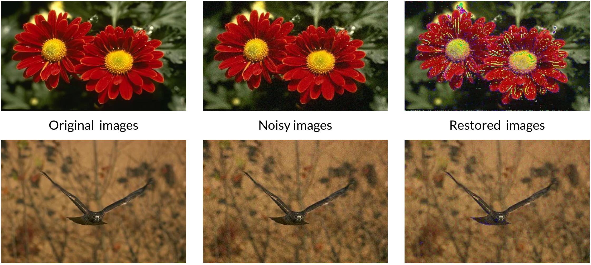

# SwinIR + Projection + FISTA

**SwinIR+projection/FISTA pipeline for denoising and deblurring**



## Implemented
1. **SwinIR** blind model
2. **SwinIR** with projection layer
3. **ISTA/FISTA** algorithms for deblurring with known kernels

## Build

```
git clone https://github.com/JSingh6413/SwinIR.git
cd SwinIR
```

### Using virtualenv:
```
python3 -m venv env
source env/bin/activate
pip install -r requirements.txt
...
deactivate
```

### Using conda:
```
conda create --name swinir
conda activate swinir
conda install pip
pip install -r requirements.txt
...
conda deactivate
```

**Hint!** You have to install ```cuda``` and ```cudnn``` in order to use GPU with pytorch.

## Download data

To download and preprocess data:
```
cd datasets
```

### Predefined 

There are two main predefined processing pipelines:
1. ```./fetch_BSD500.sh ``` to download [The Berkeley Segmentation Dataset](https://www2.eecs.berkeley.edu/Research/Projects/CS/vision/bsds/). \
  It will be loaded, merged and then splitted again into train and test with 432 images in the train set and 78 in the test set.


2. ```./fetch_blur80.sh``` to download 80 images and 8 kernels from Sun deblurring dataset.\
  Images will be blurred with each kernel and then gaussian noise with std 0.01 and 0.05 will be added.
  
### Custom
```./merge.py -h``` - merge multiple datasets into one folder with resolving conflicts.\
```./split.py -h``` - split single dataset into the train and test subsets. Data can be splitted both with number and percentage of the test images.\
```./process.py -h``` - apply given transforms from ```transforms.py```: blur with custom or gaussian kernel, rescale, add gaussian noise, etc.
  
## Main scripts


## Experiments
